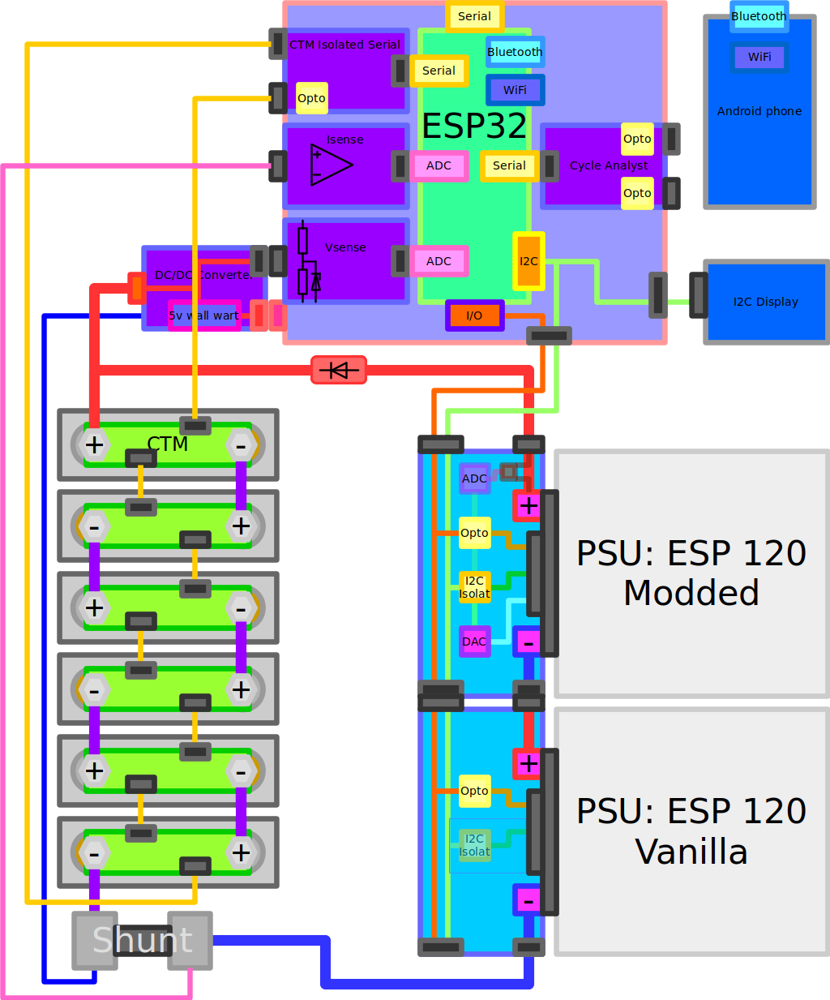
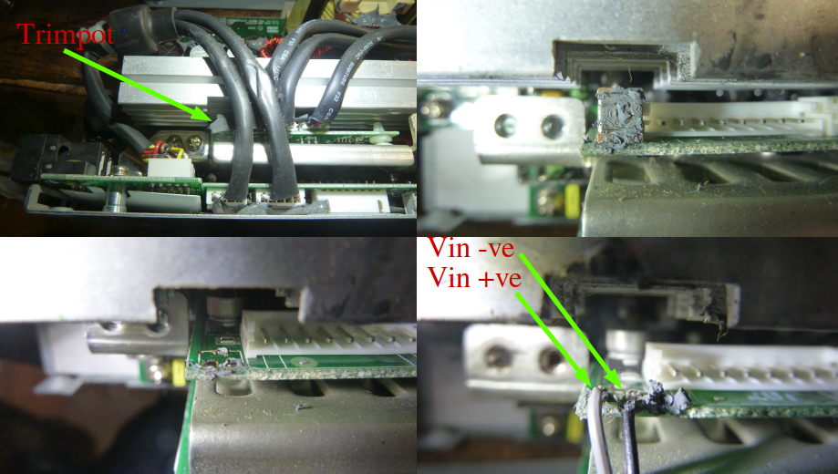
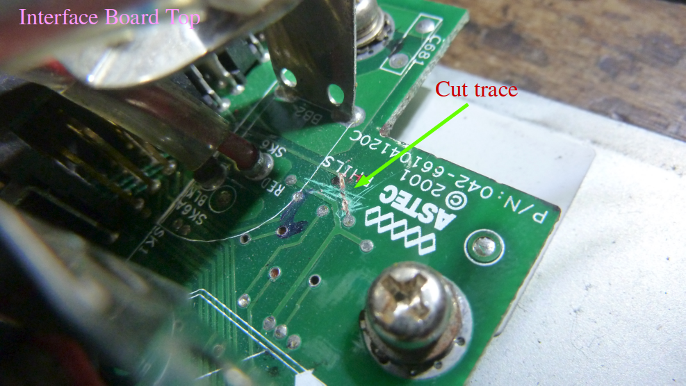
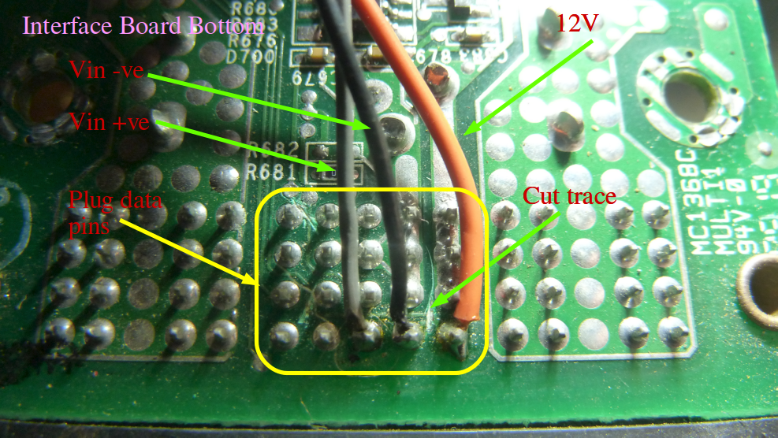
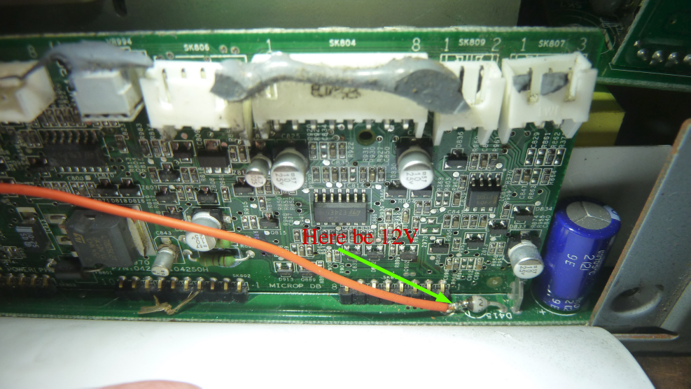

LiFePO4 Charge Controller
=========================

This project is for a fully automatic
_LiFePO4_ battery charger for my, utilising the HP Blade power supply ESP-120 as power source, and fully integrated with a Cell Top Module (CTM) Battery Management System (BMS). The _charger_ is essentially a battery monitor and manager that also charges when power is available to the vehicle.

Principal of operation
----------------------
LiFePO4 batteries have a relatively simple charging profile:

 * Charge at constant current until the maximum cell voltage is just below the balancing voltage
 * Vary charge voltage ensuring the maximum cell voltage is (just) below balancing voltage until the charge current is at or below 1A
 * Once charge current is at or below 1A charge at 1A until all cells are balancing
 
### Overview


### Charge control
Thanks to the efforts of a German group the ESP-120 is well documented with a known and stable voltage control from 30-53V with positive voltage into a trim-pot pin, and 53-63V with a slight negative voltage to this pin. There is an inverse relationship between voltage at the pot, and the supplies output voltage:
```
~5Vin => 30Vout
 0Vin => 53Vout
```
To operate as a charger two (or more) PSU's are connected in series which is possible as the DC output is isolated from
the case.
To achieve constant current charging, the voltage of the supplies is brought up slowly by modifying (decreasing) Vin 
whilst monitoring the current until the desired current is reached.

Not all PSU's in series need to modify their output voltage in order to achieve fine grained charge control. In my case one PSU has a varying voltage, and one does not.
The PSU's with a varying voltage are modified by removing the trim-pot and cutting/modding traces at the output plug to allow the signals to be routed from external connector.

The PSU's are protected by a large external diode (75A, 200V).

### Cell Top Modules
Each battery cell has a CTM across it which:
 * Measures cell voltage
 * Measures cell temperature
 * Switches on a 1A load once `Vbalance` is reached

The CTM's are connected in a daisy chain and communicate via serial with the cell top monitor. The CTM state's are found by sending an initialisation message to the first CTM, which adds its state to the message and passes it to the next CTM etc. until finally the packet with all cell states arrives back at the monitor. 

## Project iterations
1.  **Mark I: Proof of concept using onboard** (Done)

    - Construction on breadboard
    - Powered off the PSU power GND - 12V via an LM7805, so has common ground with Cycle Analyst
    - shunt and differential opamp via built in 10bit ADC for current measurement
    - 100:1 resistor divider via 10bit ADC for output voltage measurement
    - Output is a PWM based 'DAC' to a fet/transistor between two pot's setting max/min voltage.
    - Output/input via isolated serial interface.
  
2.  **Mark II: further improvements** (Done)
    - Impliment isolated I2C to PSU controllers for PSON and current measurement.
    - Check PSU current VS shunt current, once verified they are the same with similar reliability, discontinue use of shunt.
    - Implement software USART for Rx only to receive SOC etc. from the cycle analyst
    - Assess whether external DAC's and ADC's are necessary.
    - Likely that external ADC will be, so use it.
    - Investigate and implement different charging strategies.
    - LCD?
    - BMS integration
  
3.  **Mark III: Integrated controller** (In progress)
    - ESP32 platform, on separate board as PSU's so can run independently
    - Arduino codebase for greater platform independence and collaboration
    - Integrated CTM monitor
    - Custom PSU plug boards.
        1. Modified PSU for varying voltage output
        2. Unmodified PSU
        3. Boards plug together on edges for stackability
    - Voltage control via I2C DAC
    - Current measurement from external shunt
        - Optional current measurement on PSU plug board
    - Voltage measurement at battery terminal
    - WiFi and Bluetooth interface
    - Optional I2C display interface
    
Repo layout
-----------
```
.
├── code            Charge controller logic
│   └── AVR-lib     General AVR libraries. Should be a submodule
│       └── lib
├── doc             Documents relating to the ESP-120/HP3KW
├── pcb             Output PCB files
└── schematic       Schematic
```

The code is written in C++/Arduino using [PlatformIO], ideally exporting to Makefile.

The schematic and PCB layout are done in [Kicad]

Inputs:
-------
 **Current:** 
   Current will be measured using an external 75mV shunt and an op-amp. As the battery and the controller share the same ground there is no need to use a differential op-amp. 
   This will be read by an internal (to the ESP-32) 12bit SAR ADC using the internal 1.1`Vref`.
   Current measurements can also be taken from the PSU via I2C.
   
 **Battery Voltage:**
   Battery voltage will be measured via a 100k:1k resistor divider network protected with a zener diode. A dedicated `Vsense` lead will be attached to the positive battery terminal to avoid voltage drops in wires and diodes influencing the voltage.
   This will be read by an internal (to the ESP-32) 12bit SAR ADC using the internal 1.1`Vref`.
   
 **PSU State:**
   The PSU state can be inspected via isolated I2C, and returns the following and more:
   
   - Line voltage
   - Output current
   - Temperature
   
 **CTM:**
   CTM state will be inspected via isolated serial, and gives us the following per cell:
   
   - Cell voltage
   - Cell temperature
   - Cell state
     - Balancing
     - Over voltage
     - Over temperature
   
Outputs:
--------
 **Vin:**
   The PSU control voltage, `Vin` will be controlled via I2C DAC via an inverting op-amp to ensure the power on state is high.
      
 **Serial:**
   Debugging and logging will be via serial
 
 **I2C Display:**
   An (optional) I2C display will show the per cell voltage and other state information
   
 **LED's and stuff:**
   - Blinking light (things alive)
   - Charging
   - Complete
   - State of charge bar graph for in the window 8)
   - Even better would be EL wire or tape on the exterior.
  
 **Phone App:**
   An Android app using Bluetooth would be the ideal solution for greatest versatility

Power supply modifications
--------------------------
In order for the PSU's to be variable voltage some minor modifications need to be made:

### Trimpot, `Vin`
A trimpot needs to be removed and wires attached as `Vin`:
Remove surrounding plugs, clear off silicoln blob, and heat it up any way yo can 8)


### Interface board
The _interface board_, the PCB with the external power and data plug, needs to be modified such that we can get the 12V out, and `Vin` in, whilst maintaining `PSON` and `I2C` functionality:



### 12V supply
**Note:** The 12V supply may not be required.

12V is most easily tapped from the left hand leg of a diode on the secondary power board as shown below:


PCB's and circuit considerations
--------------------------------


[platformIO]: http://platformio.org/
[kicad]: http://kicad-pcb.org/